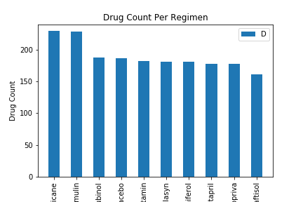

# Power of Plots using Matplotlib

## Project Overview

* Analyze impact of 4 drug treatments performed on 250 mice identified with SCC tumor growth over 45 days of clinical trial.
* Leverage power of plots generated using Matplotlib libraries to perform statistical analysis and derive observations.


## Dependencies

Installation requires [numpy](https://numpy.org), [scipy](https://www.scipy.org), [pandas](https://pandas.pydata.org),[Matplotlib](https://matplotlib.org) and [Jupyter Notebook](https://jupyter.org/install).

## Analysis

* Capomulin outperformed Infubinol and Ceftamin by a significant margin. However Ramicane performed slightly better than Capomulin with average tumor size 34.84 as compared to 37.31 of Capomulin.

* Mouse s185 treated with Capomulin showed 51% reduction in tumor volume, however a slight increase in tumor volume was observed between 10 and 15 days of the treatment. This might imply minimal treatmeant period necessary to see sustained results.

* Average tumor volume increased exponentially with increase in mouse weight. This might imply need for higher drug dosage with increase in weight.

## Execution

### Dependencies and starter code

```import matplotlib.pyplot as plt
import pandas as pd
import scipy.stats as st
import numpy as np
import seaborn as sns
from scipy.stats import linregress

# Study data files
mouse_metadata = "data/Mouse_metadata.csv"
study_results = "data/Study_results.csv"

# Read the mouse data and the study results
mouse_metadata = pd.read_csv(mouse_metadata)
study_results = pd.read_csv(study_results)

# Combine the data into a single dataset
combined_df = pd.merge(mouse_metadata,study_results,how='outer',on='Mouse ID')
combined_df.to_csv("data/combined.csv", index=False, header=True) 
```

### Summary statistics of the tumor volume for each drug regimen.

```
summary_stats = combined_df.groupby(['Drug Regimen']).agg({'Tumor Volume (mm3)': ['mean','median','var','std','sem']})
summary_stats.columns = ['Mean', 'Median', 'Variance','Standard Deviation','Standard Error of Mean']

summary_stats.head()
```

| Drug Regimen  |  Mean         | Median    | Variance  | Standard Deviation| Standard Error of Mean|
| ------------- |:-------------:| ---------:| ---------:| -----------------:| ---------------------:|
| Capomulin     | 40.675741     | 41.557809 | 24.947764 | 4.994774          | 0.329346              |
| Ceftamin      | 52.591172     | 51.776157 | 39.290177 | 6.268188          | 0.469821              |
| Infubinol     | 52.884795     | 51.820584 | 43.128684 | 6.567243          | 0.492236              |
| Ketapril      | 55.235638     | 53.698743 | 68.553577 | 8.279709	        | 0.603860              |
| Naftisol      | 54.331565     | 52.509285 | 66.173479 | 8.134708          | 0.596466              |


### Bar plot using Matplotlib's pyplot that shows number of data points for each treatment regimen.

```
regimen_count = combined_df['Drug Regimen'].value_counts()
regimen = [reg for reg in combined_df['Drug Regimen'].unique()]

plt.bar(regimen, regimen_count,linewidth=1,align="center",width=0.5)
plt.xticks(rotation=90)
plt.ylim(0, max(regimen_count)+10)

plt.legend("Drug Count")
plt.title("Drug Count Per Regimen")
plt.xlabel("Drug Regimen")
plt.ylabel("Drug Count")
```


### Pie plot using Matplotlib's pyplot that shows the distribution of female/male mice in the study.
```
gender_df = combined_df[['Sex']]
labels = ["Male", "Female"]
explode = (0, 0)
colors = ["red","lightskyblue"]
```


### Calculate final tumor volume of each mouse across four of the most promising treatment regimens: Capomulin, Ramicane, Infubinol, and Ceftamin. Calculate the quartiles and IQR and quantitatively determine if there are any potential outliers across all four treatment regimens.

```
promising_regimens_df = combined_df.loc[combined_df['Drug Regimen'].isin(['Capomulin','Ramicane','Infubinol','Ceftamin'])]
promising_regimens_df = promising_regimens_df.loc[promising_regimens_df['Timepoint'] == 45]
promising_regimens_df.head()
```
#### Remicane Quartiles and outliers
```
ramicane_regimens_df = promising_regimens_df.loc[promising_regimens_df['Drug Regimen'].isin(['Ramicane'])]
ramicane = ramicane_regimens_df['Tumor Volume (mm3)']
quartiles = ramicane.quantile([.25,.5,.75])

lowerq = quartiles[0.25]
upperq = quartiles[0.75]
iqr = upperq-lowerq

print(f"The lower quartile of Ramicane is: {lowerq}")
print(f"The upper quartile of Ramicane is: {upperq}")
print(f"The interquartile range of Ramicane is: {iqr}")
print(f"The the median of Ramicane is: {quartiles[0.5]} ")

lower_bound = lowerq - (1.5*iqr)
upper_bound = upperq + (1.5*iqr)
print(f"Values below {lower_bound} could be outliers.")
print(f"Values above {upper_bound} could be outliers.")
```

```
The lower quartile of Ramicane is: 30.981175224999998
The upper quartile of Ramicane is: 38.508305307499995
The interquartile range of Ramicane is: 7.527130082499998
The the median of Ramicane is: 34.848627300000004 
Values below 19.690480101250003 could be outliers.
Values above 49.79900043124999 could be outliers.
```

#### Capomulin Quartiles and outliers

```
capomulin_regimens_df = promising_regimens_df.loc[promising_regimens_df['Drug Regimen'].isin(['Capomulin'])]
capomulin = capomulin_regimens_df['Tumor Volume (mm3)']
quartiles = capomulin.quantile([.25,.5,.75])

lowerq = quartiles[0.25]
upperq = quartiles[0.75]
iqr = upperq-lowerq

lower_bound = lowerq - (1.5*iqr)
upper_bound = upperq + (1.5*iqr)

print(f"The lower quartile of Capomulin is: {lowerq}")
print(f"The upper quartile of Capomulin is: {upperq}")
print(f"The interquartile range of capomulin is: {iqr}")
print(f"The the median of capomulin is: {quartiles[0.5]} ")

lower_bound = lowerq - (1.5*iqr)
upper_bound = upperq + (1.5*iqr)
print(f"Values below {lower_bound} could be outliers.")
print(f"Values above {upper_bound} could be outliers.")
```
```
The lower quartile of Capomulin is: 32.37735684
The upper quartile of Capomulin is: 40.1592203
The interquartile range of capomulin is: 7.781863460000004
The the median of capomulin is: 37.31184577 
Values below 20.70456164999999 could be outliers.
Values above 51.83201549 could be outliers.
```

#### Infubinol Quartiles and outliers

```
infubinol_regimens_df = promising_regimens_df.loc[promising_regimens_df['Drug Regimen'].isin(['Infubinol'])]
infubinol = infubinol_regimens_df['Tumor Volume (mm3)']
quartiles = infubinol.quantile([.25,.5,.75])

lowerq = quartiles[0.25]
upperq = quartiles[0.75]
iqr = upperq-lowerq

print(f"The lower quartile of Infubinol is: {lowerq}")
print(f"The upper quartile of Infubinol is: {upperq}")
print(f"The interquartile range of Infubinol is: {iqr}")
print(f"The the median of Infubinol is: {quartiles[0.5]} ")

lower_bound = lowerq - (1.5*iqr)
upper_bound = upperq + (1.5*iqr)

print(f"Values below {lower_bound} could be outliers.")
print(f"Values above {upper_bound} could be outliers.")

```
```
The lower quartile of Infubinol is: 62.75445141
The upper quartile of Infubinol is: 67.68556862
The interquartile range of Infubinol is: 4.9311172099999965
The the median of Infubinol is: 66.08306589 
Values below 55.35777559500001 could be outliers.
Values above 75.08224443499999 could be outliers.
```

#### Ceftamin Quartiles and outliers
```
ceftaminl_regimens_df = promising_regimens_df.loc[promising_regimens_df['Drug Regimen'].isin(['Ceftamin'])]
ceftaminl = ceftaminl_regimens_df['Tumor Volume (mm3)']
quartiles = ceftaminl.quantile([.25,.5,.75])

lowerq = quartiles[0.25]
upperq = quartiles[0.75]
iqr = upperq-lowerq

print(f"The lower quartile of Ceftamin is: {lowerq}")
print(f"The upper quartile of Ceftamin is: {upperq}")
print(f"The interquartile range of Ceftamin is: {iqr}")
print(f"The the median of Ceftamin is: {quartiles[0.5]} ")

lower_bound = lowerq - (1.5*iqr)
upper_bound = upperq + (1.5*iqr)
print(f"Values below {lower_bound} could be outliers.")
print(f"Values above {upper_bound} could be outliers.")

```

```
The lower quartile of Ceftamin is: 61.43389223
The upper quartile of Ceftamin is: 67.52748237
The interquartile range of Ceftamin is: 6.093590140000003
The the median of Ceftamin is: 64.29983003 
Values below 52.29350701999999 could be outliers.
Values above 76.66786758 could be outliers.
```
### Using Matplotlib, generate a box and whisker plot of the final tumor volume for all four treatment regimens and highlight any potential outliers in the plot by changing their color and style.

```
sns.set(style="whitegrid")
ax = sns.boxplot(x="Drug Regimen", y="Tumor Volume (mm3)", data=promising_regimens_df)
plt.savefig("images/box_plot.png")
```

### Generate a line plot of time point versus tumor volume for a single mouse treated with Capomulin.
```
s185_capomulin_df = combined_df.loc[(combined_df['Drug Regimen'] == 'Capomulin') & (combined_df['Mouse ID'] == 's185')]

timepoint = s185_capomulin_df['Timepoint']
tumorvolume = s185_capomulin_df['Tumor Volume (mm3)']

plt.plot(timepoint,tumorvolume, marker="o", color="blue")

plt.title("Timepoint vs Tumor Volume(mm3)")
plt.xlabel('Timepoint')
plt.ylabel('Tumor Volume (mm3)')
plt.grid(False)

plt.show()

plt.savefig("images/line_plot.png")
```


### Generate a scatter plot of mouse weight versus average tumor volume for the Capomulin treatment regimen.
```
capomulin_df = combined_df.loc[combined_df['Drug Regimen'] == 'Capomulin']
unique_mice_df = capomulin_df.groupby(['Mouse ID']).mean()

mouse_weights = unique_mice_df['Weight (g)']
average_tumor_volume = unique_mice_df['Tumor Volume (mm3)']

plt.scatter(mouse_weights, average_tumor_volume, marker="o", facecolors="red", edgecolors="black",
            alpha=0.75)

plt.title('Capomulin - Mouse Weight vs Average Tumor Volume')
plt.xlabel('Mouse Weight')
plt.ylabel('Average Tumor Volume')
plt.show()

plt.savefig("images/scatter_plot.png")
```

### Calculate the correlation coefficient and linear regression model between mouse weight and average tumor volume for the Capomulin treatment. Plot the linear regression model on top of the previous scatter plot.
```
correlation = st.pearsonr(mouse_weights,average_tumor_volume)
print(f"The correlation between both factors is {round(correlation[0],2)}")
```
```
The correlation between both factors is 0.84
```
```
x_values = mouse_weights
y_values = average_tumor_volume
(slope, intercept, rvalue, pvalue, stderr) = linregress(x_values, y_values)
regress_values = x_values * slope + intercept
line_eq = "y = " + str(round(slope,2)) + "x + " + str(round(intercept,2))
plt.scatter(x_values,y_values)
plt.plot(x_values,regress_values,"r-")
plt.annotate(line_eq,(16,38),fontsize=15,color="red")
plt.xlabel('Mouse Weight')
plt.ylabel('Average Tumor Volume')
plt.show()

plt.savefig("images/linear_regression.png")
```


   
